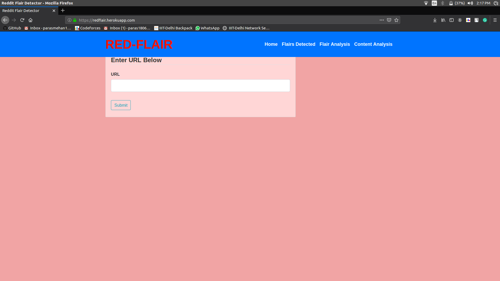
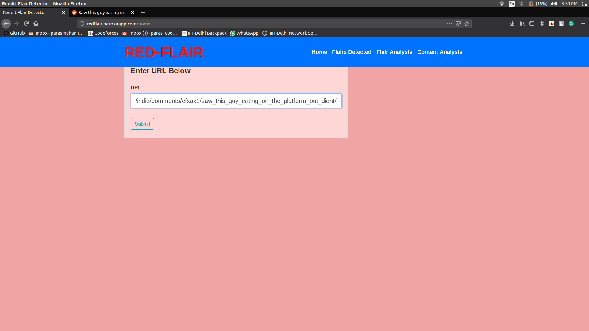
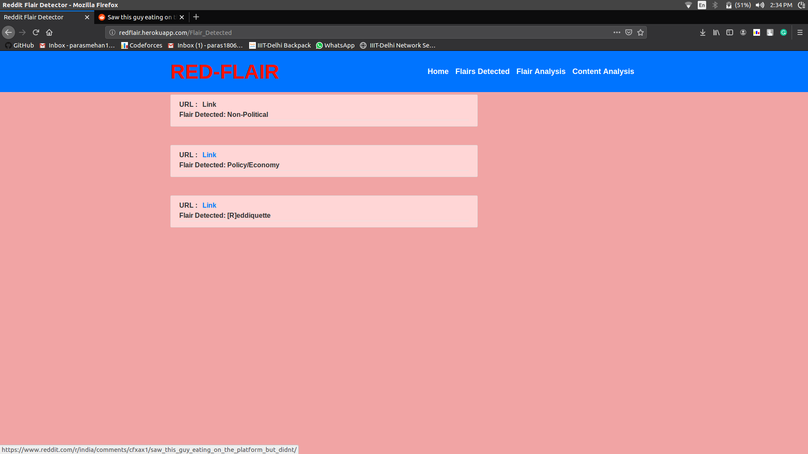
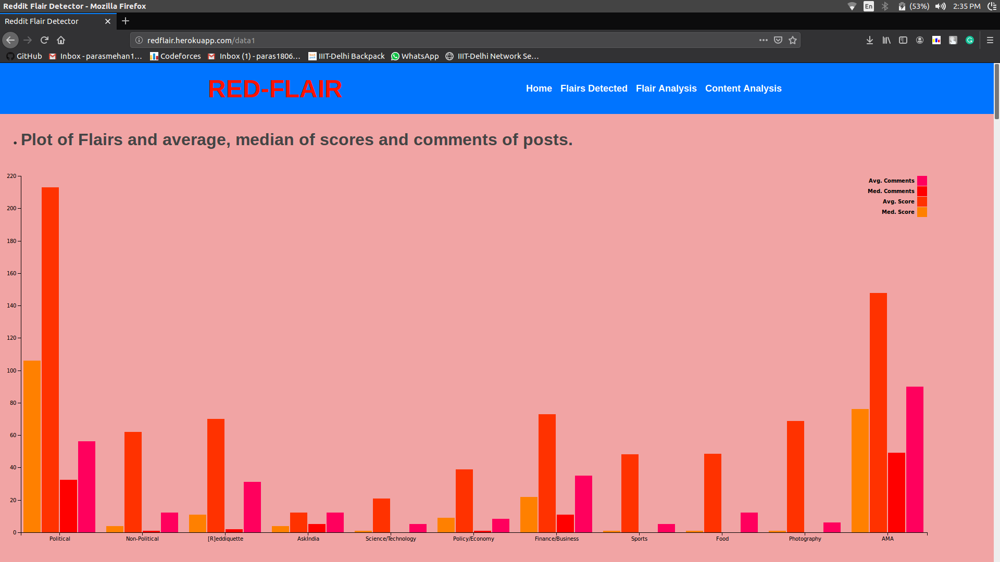
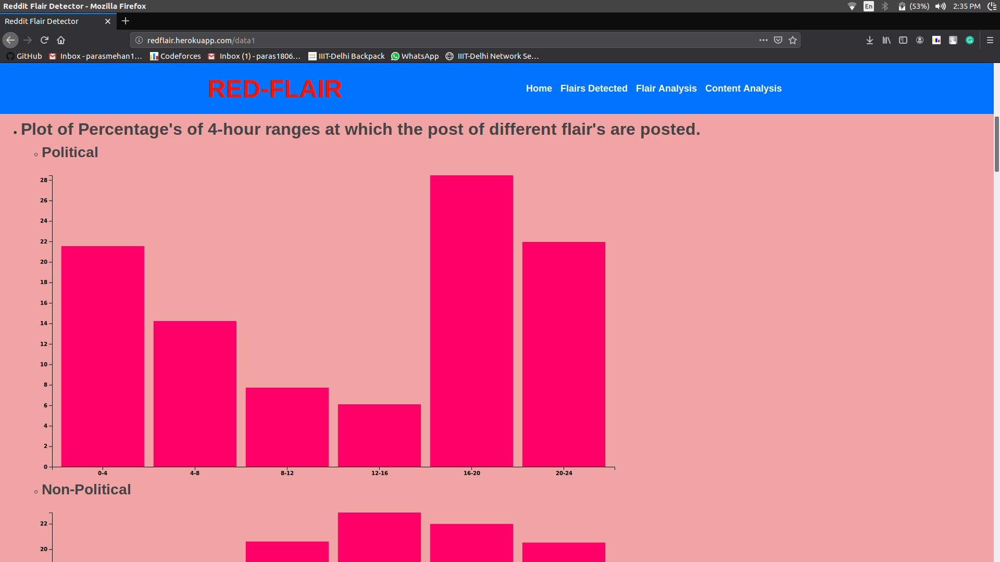
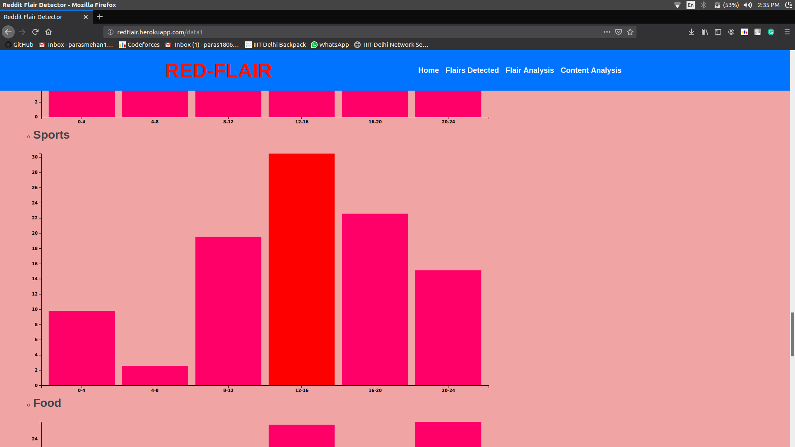
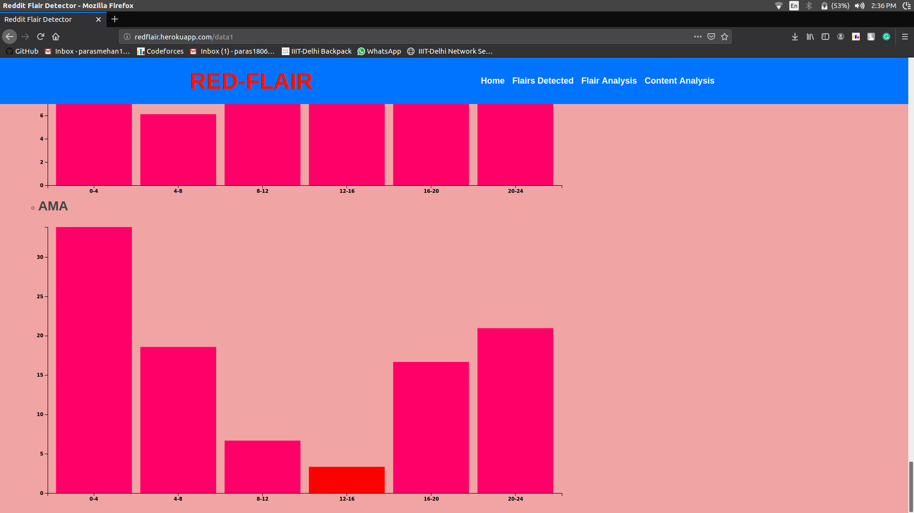
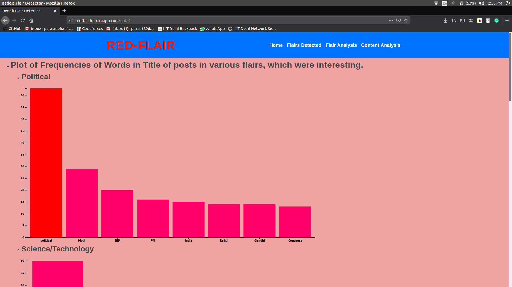
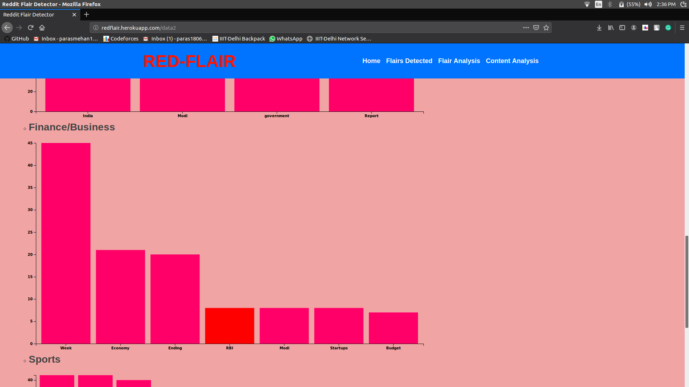
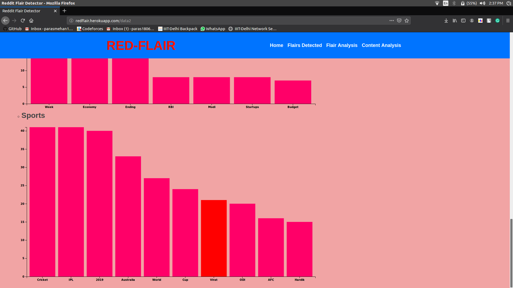

Red-Flair
=========

## Table Of Content.
* [Introduction](https://github.com/parasmehan123/RedFlair#introduction)
* [How to Use the App](https://github.com/parasmehan123/RedFlair#how-to-use-the-app)
* [Tools Used](https://github.com/parasmehan123/RedFlair#tools-used)
* [Directory Structure](https://github.com/parasmehan123/RedFlair#directory-structure)
* [Steps To Run Red-Flair](https://github.com/parasmehan123/RedFlair#steps-to-run-red-flair)
* [Dependicies](https://github.com/parasmehan123/RedFlair#dependicies)
* [Project Approach](https://github.com/parasmehan123/RedFlair#project-approach)
* [Analysis of Data](https://github.com/parasmehan123/RedFlair#analysis-of-data)
* [Sources](https://github.com/parasmehan123/RedFlair#sources)

## Introduction 
Red-Flair is a flair detector for posts belonging to [r/india](https://www.reddit.com/r/india/) subreddit on Reddit. Its web app is deployed using Heroku which can be accessed [here](http://redflair.herokuapp.com). It scrapes post's using the URL and then uses an SVC model to predict the flair of that post.

## How to Use the App 
### Steps to use the Web-app to predict flairs of posts.
1. Open the app at [Red-Flair](http://redflair.herokuapp.com).


2. Open the reddit post belongin to [r/india](https://www.reddit.com/r/india/) subreddit. Copy the full URL of the post. 


3. Paste the Link in the Url Box and click submit. 


4. This will redirect you to [Flairs Detected](http://redflair.herokuapp.com/Flair_Detected) Page. Here it will display your submitted URL on the top, and the flair that has been predected. By clicking on the link which is highlighted in blue, it would re-direct to the URL which was submitted earlier. You might need to re-fresh the pages one or twice to load the content from Heroku Servers.


## Tools Used
* Python3
* Sci-kit Learn
* NLTK
* FLASK
* Flask-WTF
* D3.JS
* Xgboost
* Praw
* Jupyter
* Mongodb Compass
* HTML/CSS
* Pandas 
* Numpy
* Heroku

## Directory Structure
<pre>
RedFlair
├── data
│   ├── csv_files
│   └── mongodb
├── images
├── others
├── static
└── templates
</pre>
* / : It contains all the files and directories.
  * app.py : The Main Python file for Flask Based Web App.
  * forms.py : A Python file for taking input from the user using Flask-WTF library.
  * model : A Pickled-version of ML model which is used to make predictions.
  * model.py : A Python file for predicting Flair.
  * nltk.txt : A txt file for Heroku for downloading "stopwords","wordnet","punkt" which are used for data cleaning.
  * Procfile : A file which contains the command which are required to run the flask based app on Heroku.
  * requirements.txt : A txt file for Heroku to satisfy the requirements to run the web app.
  * tfidf : A Pickled-version of TF-IDF VECTORIZER for converting words into vectors.
* Data : It contains all the data used in the project.
  * csv_files : It contains the data in .csv files.
  * mongodb : It contains the data in .json and .bson (mongodb instance) form.
* images : It contains all the images used to create this README.md
* others : It contains the .ipynb files which are used for scraping data, cleaning data, combining data, training various models and analysing data. 
* static : It contains the .css files for the web-app.
* templates : It contains the .html files for the web-app.

## Steps To Run Red-Flair
### Hosting Web App On Local Host
1. Clone The Repository.
```bash
git clone https://github.com/parasmehan123/RedFlair.git
```
2. change directory to RedFlair.
```bash
cd RedFlair
```
3. Follow this [tutorial](http://www.storybench.org/how-to-scrape-reddit-with-python/) to get client id,etc. of Reddit.
4. Open model.py and enter the information like client id,etc. in get_flair().
5. Run the app.py file.
```bash
python3 app.py
```
### For Re-training the model or data-analysis or data-scarping or data-combining. <a link="re"/>
1. Clone The Repository.
```bash
git clone https://github.com/parasmehan123/RedFlair.git
```
2. change directory to RedFlair.
```bash
cd RedFlair
```
3. Copy and Paste the .ipynb files from ./others/  to ./data/csv_files
```bash
cp ./others/<file>.ipynb ./data/csv_files
```
4. Open Jupyter 
``` bash
jupyter notebook
```
5. Go the the .ipynb file in /data/csv_files and select Cell > "Run All".
6. Copy paste the "model" and "tfidf" files back to /RedFlair for using it on the web app.

## Dependicies
* Flask==1.0.2
* Flask-WTF==0.14.2
* jupyter==1.0.0
* nltk==3.4
* numpy==1.16.2
* pandas==0.24.2
* praw==6.3.1
* prawcore==1.0.1
* scikit-image==0.14.2
* scikit-learn==0.20.3
* WTForms==2.2.1
* xgboost==0.90

## Project Approach
### Data Acquisition 
For data acquisition I've used 2 Methods.
#### 1. Using Praw Library :
Using Python Praw library, I was able to scrape around 1800 posts for eleven flairs, using a simple API calls. The code for data scraping is saved in [data_scraping.ipynb](/others/data_scraping.ipynb) and the data is in [data.csv](/data/csv_files/data.csv).

#### 2. Using Database on Google Big-Query.
I've found a database containing Reddit posts on google big-query.
Using the below SQL query I've been able to scrape data of 16000 posts belonging to 8 flair categories from January, February, and March 2019. I searched way back till 2017, but couldn't find posts belonging to Political, AMA, Finance/Business flair types, in the database.
```SQL

SELECT *
FROM [fh-bigquery:reddit_posts.2019_01],[fh-bigquery:reddit_posts.2019_02],[fh-bigquery:reddit_posts.2019_03]
WHERE subreddit == "india" && link_flair_text == "flair" 
LIMIT 20000
```
### Model
I've followed the following steps to ceate a model to predict flairs.
#### 1.Data Combining 
Since the data I've got from Google Big-Query didn't have the posts of few flairs types, hence I've combined this data(8 flair types) with the data (remaining three flairs) obtained by using praw library. 
Then I've divided data of each flair into testing and training with the division being 20:80. As the data from Big-Query was massive (6000 posts in Non-Political type) in certain flairs category hence I've put the condition of a maximum of 500 flairs in training data and 125 in training data. 
The code of data-combining can be found [here](/others/data_combining.ipynb) and the training data, testing data which is used to build the model can be found [here](/data/csv_files/data_train.csv) and [here](/data/csv_files/data_test.csv).

#### 2.Data Cleaning
* I've followed the following steps to clean the text of the posts.
 * Convert words to Lowercase.
 * Tokenize the word using word_tokenize.
 * Removed the stop-words.
 * Removed the punctuation.
 * Lematization using WordNetLemmatizer.
* I have used the same procedure to clean the post of new test cases on the web-app.

#### 3. Convert words to Vectors
* I've used Tf-Idf Vectorizer from Sklearn.
* I've also exported the vectorizer to be used in the web app.

#### 4. Model And Feature Selection.
* I've trained models using different classfiers and features.
##### Classifiers No.:
1. SVC
2. DecisionTreeClassifier
3. LogisticRegression
4. RandomForestClassifier
5. XGBClassifier

##### Results :

* Features : Title 

| Classfier No. | Accuracy on 5 Fold Cross-Validation on Training Set | Accuracy on Testing Set |
|:--------- |:------------|:-------------|
|1|0.8863863863863863|  0.47695390781563124| 
|2|0.9629629629629629|  0.3937875751503006| 
|3|0.7114614614614615|  0.46893787575150303| 
|4|0.9629629629629629| 0.46392785571142287| 
|5|0.6566566566566566| 0.4248496993987976| 

* Features : URL

| Classfier No. | Accuracy on 5 Fold Cross-Validation on Training Set | Accuracy on Testing Set |
|:--------- |:------------|:-------------|
|1|0.4469469469469469| 0.3897795591182365|
|2|0.4727227227227227| 0.3657314629258517|
|3|0.43343343343343343| 0.3817635270541082|
|4|0.4727227227227227| 0.3787575150300601|
|5|0.4291791791791792| 0.36472945891783565|

* Features : Body 

| Classfier No. | Accuracy on 5 Fold Cross-Validation on Training Set | Accuracy on Testing Set |
|:--------- |:------------|:-------------|
|1|0.3228228228228228| 0.23346693386773548|
|2|0.3425925925925926| 0.2154308617234469|
|3|0.2702702702702703| 0.23647294589178355|
|4|0.3425925925925926| 0.23647294589178355|
|5|0.33208208208208206| 0.251503006012024|


* Features : Title+Body 

| Classfiers No.| Accuracy on 5 Fold Cross-Validation on Training Set | Accuracy on Testing Set |
|:--------- |:------------|:-------------|
|1|0.918918918918919| 0.503006012024048|
|2|0.974974974974975| 0.3807615230460922|
|3|0.7457457457457457| 0.4939879759519038|
|4|0.974974974974975| 0.46893787575150303|
|5|0.705955955955956| 0.47194388777555113|


* Features : Body+URL 

| Classfier No. | Accuracy on 5 Fold Cross-Validation on Training Set | Accuracy on Testing Set |
|:--------- |:------------|:-------------|
|1|0.5690690690690691| 0.4198396793587174|
|2|0.6146146146146146| 0.37374749498997994|
|3|0.49424424424424424| 0.4248496993987976|
|4|0.6146146146146146| 0.40480961923847697|
|5|0.5402902902902903| 0.41783567134268534|

* Features : Title+URL 

| Classfier No. | Accuracy on 5 Fold Cross-Validation on Training Set | Accuracy on Testing Set |
|:--------- |:------------|:-------------|
|1|0.8893893893893894| 0.5200400801603207|
|2|0.977977977977978| 0.4308617234468938|
|3|0.7424924924924925| 0.5350701402805611|
|4|0.977977977977978| 0.5260521042084169|
|5|0.6896896896896897| 0.5190380761523046|

* Features : Title+Body+URL 

| Classfier No. | Accuracy on 5 Fold Cross-Validation on Training Set | Accuracy on Testing Set |
|:--------- |:------------|:-------------|
|1|0.9184184184184184|<b> 0.5531062124248497</b>|
|2|0.9854854854854855| 0.42685370741482964|
|3|0.7482482482482482| 0.5480961923847696|
|4|0.9854854854854855| 0.5320641282565131|
|5|0.6984484484484484| 0.5370741482965932|

* As I've got the best accuracy by using  Title+Body+URL as a feature and using SVC as the classfier hence I'l be using SVC model and Title+Body+URL as features to detect flairs on the web app.
* The code for data cleaning, model training and the results can be found [here](/others/Model.ipynb).

### Web-App
* The web-app is made using flask-library.
* It uses Flask-WTF forms to input the URL from user.
* It passes the URL to [model.py](/model.py)
* model.py uses the praw library to scrape the post from reddit and uses the cleaning, vectorizer and model from training processes to predict the flair of posts.
* Templates of the web app can be found [here](/templates).

## Analysis of Data
* Table of number of posts in each flair category in the data that is analysed.

| Flair     | No.of Posts |
|:--------- |:------------|
| Political | 246         |
| Non-Political | 6026 |
|[R]eddiquette|1176|
|AskIndia|5399|
|Science/Technology|1169|
|Policy/Economy|1205|
|Finance/Business|171|
|Sports|430|
|Food|305|
|Photography|507|
|AMA|210|

### Flair Wise Analysis [Link](http://redflair.herokuapp.com/data1)
* Multi-Bar Chart for analysing average/median, scores/comments of posts belonging to different flairs.


* Bar charts for analysing hour of the day at which post of different flairs are posted.




### Content Analysis [Link](http://redflair.herokuapp.com/data2)
* Bar Charts for analysis frequency of words in the title of posts in different flairs categories. 




## Sources
* For Data-Scraping:
  * https://bigquery.cloud.google.com/table/fh-bigquery:reddit_posts.2019_02?pli=1
  * http://www.storybench.org/how-to-scrape-reddit-with-python/
* For D3.js Bar Charts:
  * http://bl.ocks.org/jonahwilliams/2f16643b999ada7b1909
  * https://bl.ocks.org/curran/af72fd9c1fb61d2133d273cd8a3ca557
